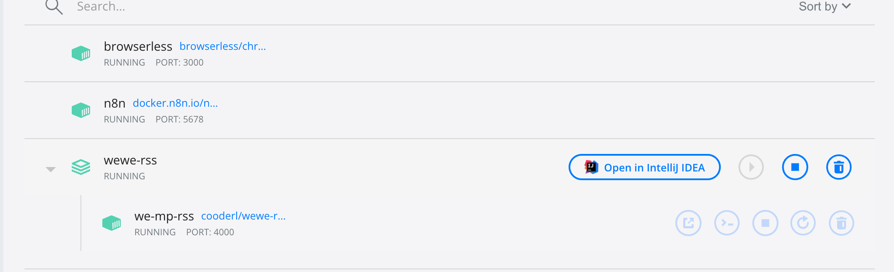
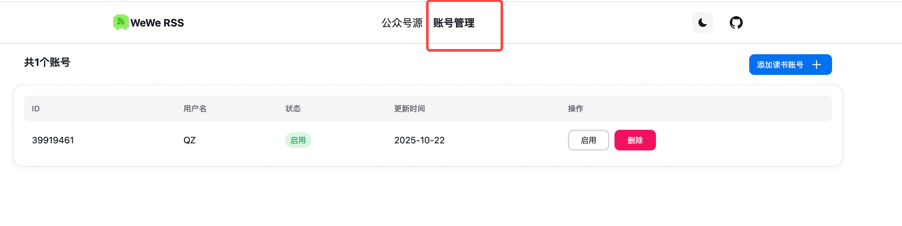
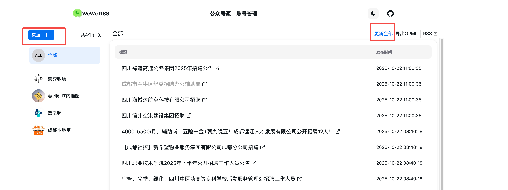
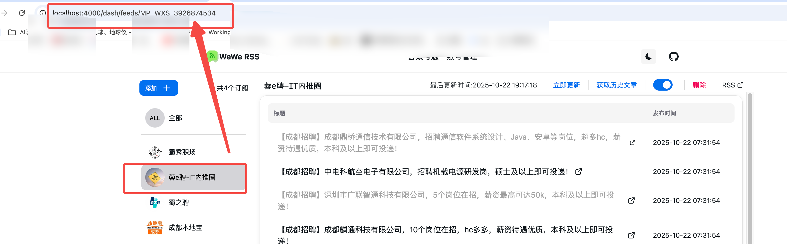
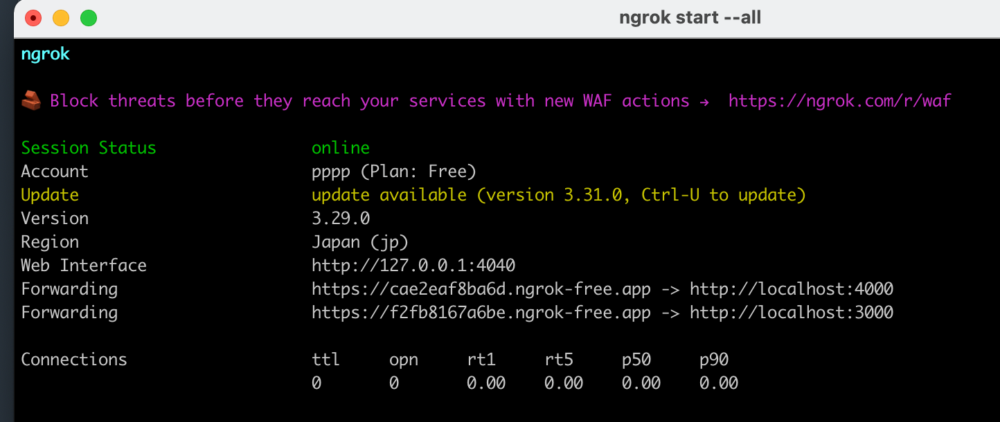
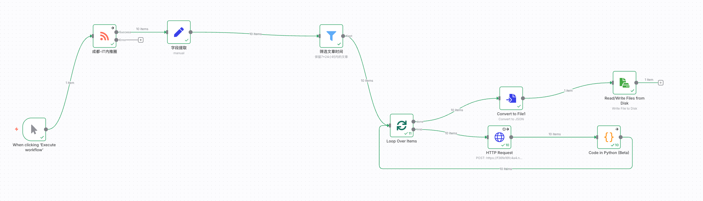
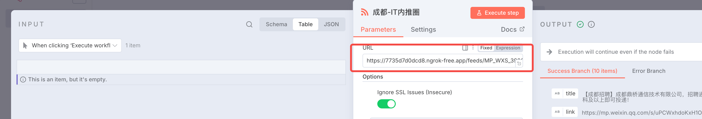
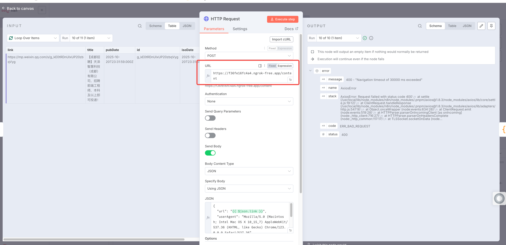
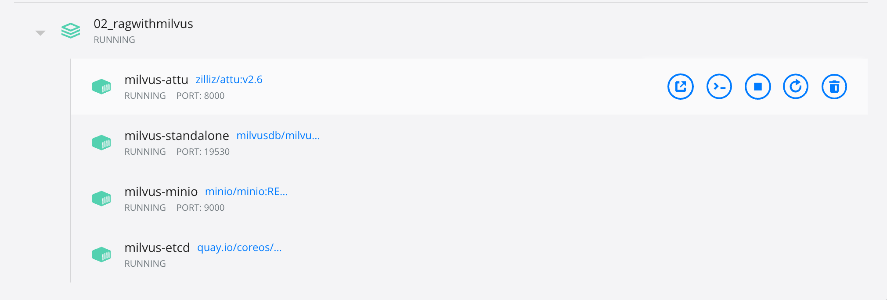

# docker本地运行n8n、browserless、wewe-rss，如下图所示：


## n8n启动命令

注意目录挂载到本地
```
docker run -d --name n8n -p 5678:5678 -e GENERIC_TIMEZONE="Asia/Shanghai" -e TZ="Asia/Shanghai" -e N8N_DEFAULT_LOCALE=zh-CN -v /Volumes/Files/n8n:/home/node/.n8n -v /Volumes/Files/n8ndata:/home/node/n8ndata -v /Volumes/Files/n8n_zh/dist:/usr/local/lib/node_modules/n8n/node_modules/n8n-editor-ui/dist docker.n8n.io/n8nio/n8n
```
## browserless启动命令

browserless主要用于在n8n的http request节点获取公众号文章内容
```
docker run -d \
  -p 3000:3000 \
  --name browserless \
  browserless/chrome:latest
```

## wewe-rss启动命令

docker-compose模式启动wewe-rss用于获取微信公众号文章内容
```
version: '3.9'
services:
  we-mp-rss:
    container_name: we-mp-rss
    image: cooderl/wewe-rss-sqlite:latest  # 使用的镜像名称
    ports:
      - "4000:4000"  # 将宿主机的4000端口映射到容器的4000端口
    environment:
      - DATABASE_TYPE=sqlite
      - AUTH_CODE=sdcdscd  # 请务必修改为一个复杂的密码，用于登录管理后台
      # - FEED_MODE=fulltext  # 可选：启用全文输出模式
      # - CRON_EXPRESSION="35 5,17 * * *"  # 可选：自定义定时更新频率（UTC时间）
      # - TZ=Asia/Shanghai  # 可选：设置容器时区为上海时间
    volumes:
      - ./data:/app/data  # 将当前目录下的data目录挂载到容器的/app/data，实现数据持久化
    restart: unless-stopped  # 容器意外退出时自动重启
```

# 创建工作流，获取公众号岗位信息

## 获取公众号rss源
访问`http://localhost:4000`, 初次应该需要AUTH_CODE，这个在你启动wewe-rss容器时设置的密码，登录即可。
然后需要登录一个微信账号，使用微信扫码登录即可。



获取到下图中的地址，便于后面使用：


## 使用ngrok反向代理本地服务
由于需要反向代理3000、4000两个端口，因此需要使用一个配置文件，然后一次启动两个端口的代理：
修改/Users/wqz/.ngrok2/ngrok.yml配置文件，没有就新建，内容如下：
 ```
version: "2"
authtoken: 32xVpJxxugcgjZvmOUKHsD_69Lx7tjvxgcq1suEUGuLA

tunnels:
  browserless:
    proto: http
    addr: 3000
    host_header: localhost
  wewerss:
    proto: http
    addr: 4000
    host_header: localhost
 ```
使用ngrok start --all --log=stdout命令启动代理，--log=stdout非必须，只是为了方便查看一些启动日志，比如实际使用的配置文件的路径。



## 搭建工作流
访问`http://localhost:5678/workflow`, 创建工作流。具体内容见`招聘信息获取工作流.json`文件，可以直接导入到n8n的工作流直接使用。
效果如下图所示：


注意 入参的url需要换成ngrok代理后的地址，替换为4000端口的地址：
http://localhost:4000/dash/feeds/MP_WXS_3926874534
需要替换为
https://7735d7d0dcd8.ngrok-free.app/feeds/MP_WXS_3926874534

另外，http request节点的请求url也需要进行替换，替换为：ngrok的外网地址/content


## 岗位数据示例
见 jobs.json文件内容

# 职位信息存入milvus向量数据库

## 使用docker-compose运行milvus数据库
 ```
version: '3.5'

services:
  etcd:
    container_name: milvus-etcd
    image: quay.io/coreos/etcd:v3.5.18
    environment:
      - ETCD_AUTO_COMPACTION_MODE=revision
      - ETCD_AUTO_COMPACTION_RETENTION=1000
      - ETCD_QUOTA_BACKEND_BYTES=4294967296
      - ETCD_SNAPSHOT_COUNT=50000
    volumes:
      - ${DOCKER_VOLUME_DIRECTORY:-.}/volumes/etcd:/etcd
    command: etcd -advertise-client-urls=http://etcd:2379 -listen-client-urls http://0.0.0.0:2379 --data-dir /etcd
    healthcheck:
      test: ["CMD", "etcdctl", "endpoint", "health"]
      interval: 30s
      timeout: 20s
      retries: 3

  minio:
    container_name: milvus-minio
    image: minio/minio:RELEASE.2024-12-18T13-15-44Z
    environment:
      MINIO_ACCESS_KEY: minioadmin
      MINIO_SECRET_KEY: minioadmin
    ports:
      - "9001:9001"
      - "9000:9000"
    volumes:
      - ${DOCKER_VOLUME_DIRECTORY:-.}/volumes/minio:/minio_data
    command: minio server /minio_data --console-address ":9001"
    healthcheck:
      test: ["CMD", "curl", "-f", "http://localhost:9000/minio/health/live"]
      interval: 30s
      timeout: 20s
      retries: 3

  milvus:
    container_name: milvus-standalone
    image: milvusdb/milvus:v2.6.0
    command: ["milvus", "run", "standalone"]
    security_opt:
    - seccomp:unconfined
    environment:
      ETCD_ENDPOINTS: etcd:2379
      MINIO_ADDRESS: minio:9000
      MQ_TYPE: woodpecker
    volumes:
      - ${DOCKER_VOLUME_DIRECTORY:-.}/volumes/milvus:/var/lib/milvus
    healthcheck:
      test: ["CMD", "curl", "-f", "http://localhost:9091/healthz"]
      interval: 30s
      start_period: 90s
      timeout: 20s
      retries: 3
    ports:
      - "19530:19530"
      - "9091:9091"
    depends_on:
      - "etcd"
      - "minio"

  attu:
    container_name: milvus-attu
    image: zilliz/attu:v2.6
    environment:
      MILVUS_URL: milvus:19530
    ports:
      - "8000:3000"
    depends_on:
      - "milvus"
    networks:
      - default


networks:
  default:
    name: milvus
 ```

将上述内容保存为`docker-compose.yml`文件，然后使用`docker compose up -d` 启动，启动后效果如下所示：


## 创建数据库

参考`01_createDatabase.py`文件创建数据库，只需要将数据库名称改成`jobs_rag`。

当然也可以通过访问`http://localhost:8000/#//` ，登录后，通过可视化页面进行数据库创建。

## 创建表（collection）

