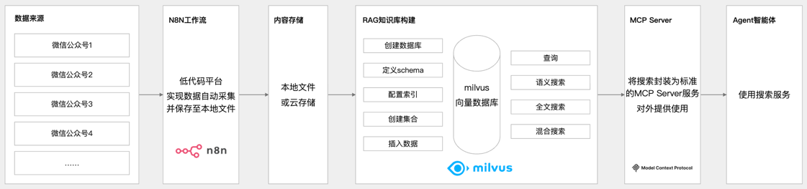

# 1、项目介绍
AI在企业应用的不尽如人意，不仅仅在于工程上的高要求，也在于开发者往往容易沉浸于某些技术细节，却忽视真实场景的复杂性       
以看似简单的AI内容搜索为例，用户的需求远非“搜索下关于时序增强关系敏感知识迁移的文章”这样的单维问题，靠着“知识库+向量+LLM”可以轻松解决              
而实际情况可能是:              
"搜索关于时序增强关系敏感知识迁移相关的文章，文章发布时间在2025.09.05之前，发布者是新智元，返回3篇文章并给出文章的标题、链接、发布者"           
这类请求融合了向量相似(文本语义)、关键词全文搜索、条件精确过滤、混合搜索等。问题的瓶颈不在LLM，更不是向量数据库。而是:          
企业AI应用的大量场景从来都不是孤立的，更多的是与企业的业务紧密联系，这体现在应用、流程与数据多个层面           
   
本项目为大家提供一种解决方案思路，以一个完整的闭环应用案例为大家介绍如何实现如下的搜索:             
"搜索关于时序增强关系敏感知识迁移相关的文章，文章发布时间在2025.09.05之前，发布者是新智元，返回3篇文章并给出文章的标题、链接、发布者"           
更甚者，存在无关条件信息的干扰，如:                  
搜索关于时序增强关系敏感知识迁移相关的文章，文章发布时间在2025.09.05之前，发布者是新智元，字数在200字内，价格不超过500元，返回3篇文章并给出文章的标题、链接、发布者                     

主要实现的功能:       
(1)使用低代码平台N8N实现对多个微信公众号文章进行自动采集并保存到本地文件                               
(2)使用主流的开源云原生向量数据库milvus将采集到的数据存储到知识库中并满足语义搜索、全文搜索及混合搜索                                    
(3)将搜索功能封装为标准的MCP Server对外提供服务                               
(4)大模型(Agent)使用搜索MCP Server进行内容搜索                      
整体业务流程如下图所示:             
       

# 2、前期准备工作
## 2.1 集成开发环境搭建  
anaconda提供python虚拟环境,pycharm提供集成开发环境                                              
**具体参考如下视频:**                        
【大模型应用开发-入门系列】03 集成开发环境搭建-开发前准备工作                         
https://youtu.be/KyfGduq5d7w                     

## 2.2 大模型LLM服务接口调用方案
(1)gpt大模型等国外大模型使用方案                  
国内无法直接访问，可以使用代理的方式，具体代理方案自己选择                        
这里推荐大家使用:https://nangeai.top/register?aff=Vxlp                        
(2)非gpt大模型方案 OneAPI方式或大模型厂商原生接口                                              
(3)本地开源大模型方案(Ollama方式)                                              
**具体参考如下视频:**                                           
【大模型应用开发-入门系列】04 大模型LLM服务接口调用方案                    
https://youtu.be/mTrgVllUl7Y                           

# 3、项目初始化
## 3.1 下载源码
GitHub或Gitee中下载工程文件到本地，下载地址如下：                   
https://github.com/NanGePlus/RagWithMilvusTest                                                                                    
https://gitee.com/NanGePlus/RagWithMilvusTest                                                                                                   

## 3.2 构建项目 
使用pycharm构建一个项目，为项目配置虚拟python环境                                   
项目名称：RagWithMilvusTest                                                                                 
虚拟环境名称保持与项目名称一致                 

## 3.3 将相关代码拷贝到项目工程中           
将下载的代码文件夹中的文件全部拷贝到新建的项目根目录下                           

## 3.4 安装项目依赖                                  
新建命令行终端，在终端中运行如下指令进行安装                        
pip install pymilvus==2.6.0                            
pip install openai==1.101.0                                 
pip install mcp==1.8.0                                  
**注意:** 建议先使用要求的对应版本进行本项目测试，避免因版本升级造成的代码不兼容。测试通过后，可进行升级测试                                     

# 4、功能测试
详见各个部分的说明文档                
